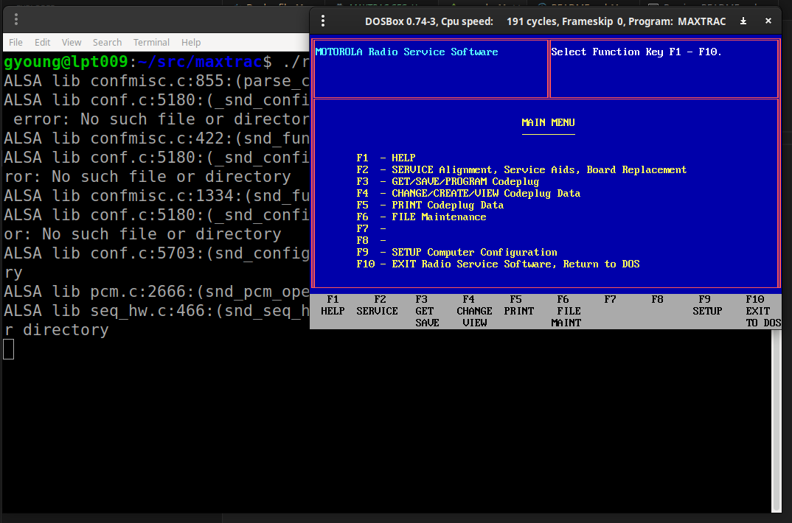
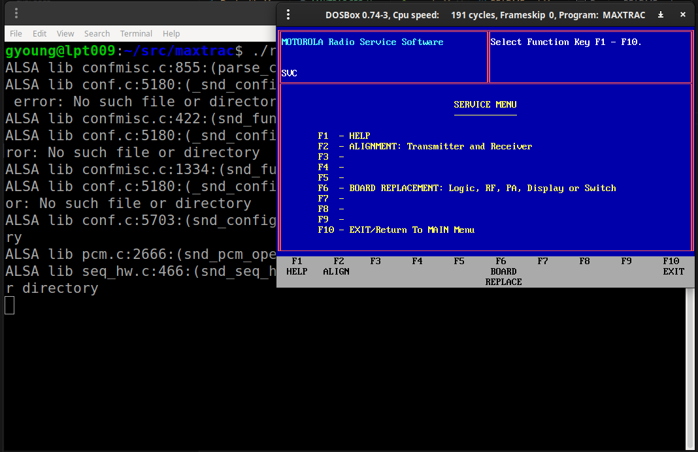

# Run Motorola Maxtrac Lab Software for DOS in a Docker container

Purpose: this docker container will allow you to run Motorola RSS software for codeplug programming,
radio maintenance or board provisioning. 

- Tested on Ubuntu Linux 24.04

Setup:
1. install Docker Engine on Linux [Setup Docker Engine](https://docs.docker.com/engine/install/ubuntu/)
1. build this docker image, from this directory run the following:

```sh
$ docker build -t maxtrac .
```

- Running RSS:

3. This is an X11 application: be sure to forward X11 from Docker Engine to your local session:
To forward the X11 session from docker to your current session

```sh
xhost +local:docker
```

4. Then run the container:
./run.sh



Maxtrac RSS Menu


Service Menu

I'm using an FDTI USB to 9 pin serial cable with this details
```sh
Bus 001 Device 005: ID 0403:6001 Future Technology Devices International, Ltd FT232 Serial (UART) IC
```

and a "DB9" to "RJ45" serial cable for GM300/Maxtrac radios obtained from Amazon, Ebay, etc..

To clean up the X11 firewall change if desired, run:

```sh
xhost -local:docker
```

## TODO:
- Add support for Lab software
- Add support for more Radios GM300, etc
- Update documentation
- Cover trunking to conventional conversion
    -- 900mhz D27Mxxx trunking to conventional, retune, etc

if desired: To modify DOS's AUTOEXEC.bat please see the tail end of the file: dosbox-0.74-3.conf

---
